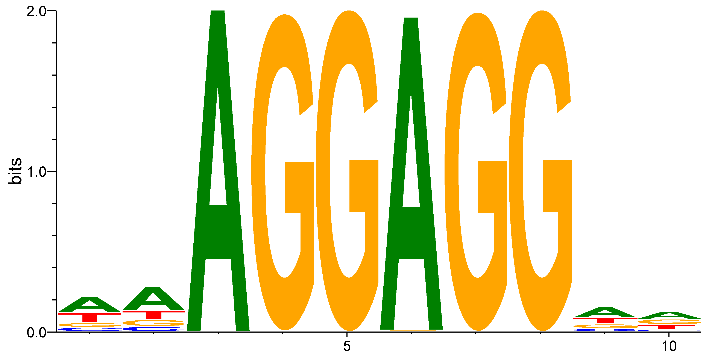
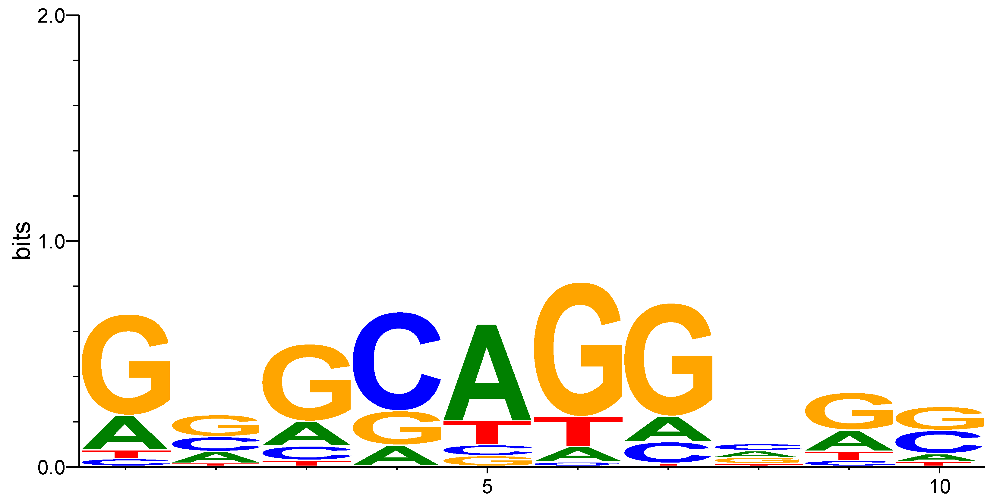

# Introduction
Identifying regulatory motifs — short, recurring sequence patterns such as transcription factor binding sites — is a central problem in computational biology. Because these motifs are typically short, degenerate, and scattered across many sequences without exact alignment, they cannot be found through simple string matching alone; the search space of 
possible motif positions and compositions grows too large for exhaustive search to be practical.

This project implements Gibbs sampling, a Markov Chain Monte Carlo (MCMC) approach to identifying sequence enrichment. Gibbs sampling uses a stochastic, optimization-based strategy: it starts from a random guess, iteratively scores candidate positions against a position weight matrix (PWM) representing the current best estimate of the motif, and  resamples one sequence's position at a time — conditioned on the model built from all other sequences — to converge toward an optimal solution.

# Pseudocode
```
 GibbsMotifFinder(seqs, k, seed):
	SET random seed

	FOR each sequence:
		CHOOSE a random k-mer and strand
		STORE the motif and its strand

	BUILD a PFM from all motifs

	REPEAT up to number of sequences × 100 times:
		CHOOSE a random sequence i
		REMOVE its motif’s counts from the PFM
		BUILD a PWM from the remaining motifs

		EVERY number-of-sequences iterations:
			RECORD information content of the full motif set
			IF more than 6 values have been recorded:
				COMPARE averages of the latest 3 and previous 3 values
				STOP if the difference is less than 0.2

		FOR each k-mer position in sequence i:
			SCORE the forward k-mer and its reverse complement
			KEEP both as candidates with their strand labels

		CONVERT scores to weights using 2 ** score
		NORMALIZE weights into probabilities
		CHOOSE a candidate using those probabilities

		REPLACE motif i with the chosen motif and strand
		UPDATE the PFM with the chosen motif’s counts

	RETURN the final PFM   
```

# Successes
We all seemed to be getting the hang of GitHub and managing pull requests and collaborative coding. We had great success meeting and partner coding over teams calls, as well as working independently and keeping each other up to date on the progress of our collective code. We also got more comfortable talking through the parts we didn’t understand, especially how to score and sample motifs from both strands. 

We successfully got the Gibbs sampler running and generated sequence logos showing AGGAGG or its reverse complement, CCTCCT. Seeing the expected pattern in our output helped us connect what the algorithm was doing to the biological motif we were trying to find.

We ran the sampler on the full NRF1 dataset, but the resulting motif was less clear than in the promoter example. Further testing of our stopping condition and comparison across runs would help us evaluate this result.

## Sample outputs: 

Example output from our Gibbs sampler with k = 10. The logo shows the AGGAGG motif. Letter heights show how consistently each base appears at that position.


Sequence logo generated from the full NRF1 dataset using k = 10. Letter heights show how consistently each base appears at that position.

# Struggles
**Issue:** Our group struggled for a while understanding how to implement the forward and reverse strands.

**Fix:** We took time to talk it out with eachother, and determined how we wanted to proceed with the scoring and keeping track of forward and reverse strands. We ended up deciding to keep track of the strands by appending either `0` or `1` for forward and reverse complement respectively.

**Issue:** When first running the "Challenge Yourself" section, we came up with a completely empty graph. 

**Fix:** We figured out that it could likely be because we still had harcoded the number of iterations to loop through when finding motifs, menaing maybe things had not converged by that time. We fixed this by using the `pmf_ic()` function, to correctly check for and monitor the status of convergence.

**Issue:** We had trouble generating the sequence logo because `seqlogo` could not find Ghostscript. Installing it through Homebrew also kept getting stuck and eventually failed.

**Fix:** We used Stack Overflow and Claude to help troubleshoot the installation. One group member ended up needing to install Ghostscript through MacPorts and adding its location to the notebook’s PATH so seqlogo could find it. After that, the graph worked.

**Issue:**  Our NRF1 output did not clearly resemble the known NRF1 binding motif, even after running the sampler on the full dataset.

**Fix:** If we had more time, we would like to test our stopping condition and compare results across multiple runs to better understand this difference in motifs. 

# Personal Reflections
**Group Leader: Maggie Wenger**

I think this project was an overall success. Our group was able to work together really well both asynchonously and synchronously over Teams and GitHub to work through the algorithm throughout the two weeks. I (along with my group members) struggled in the beginning and had to spend time with pen and paper just to figure out the concept and the logitstics of what this code was supposed to do and how to tackle it. Spending this much time problem-solving and getting knee-deep in the code really helped me to understand what Gibbs Sampling does and how to weight our randomization at nearly every step.

Future Directions: If we had more time to work on this code, one of the things I would have liked to do would be to make more functions, so that our main `GibbsMotifFinder()` wasn't so crowded. For example, having a helper function `init_motifs()` for initializing motifs at each sequence, and `check_convergence()` for finding if we have reached convergence during our iterations.

**Other Members: Justin Gubbens**

Overall, I feel that we did a good job helping each other understand the Gibbs sampling approach and working together to design a successful implementation of it. Our workflow was efficient and organized, and we made sure that we were always on the same page regarding the project. Conceptually, we took a bit of time to understand how to implement reverse strands into the GibbsMotifFinder method and understand how it would work with our initial design. With some effort and guidance from the extra posted video on Canvas, we were able to implement this in a logical way. Overall, I think we were successful in this project and learned a lot from doing it.

**Other Members: Selin Uenal**  

I think this project went well, and I felt more comfortable collaborating on coding with my group. Meeting over Teams periodically throughout this project helped us to walk through the pseudocode and address issues in our program. I struggled most with understanding how the forward and reverse strands fit into the algorithm. Once we worked through that, the process made a lot more sense to me. I also got a better understanding of how Gibbs sampling uses scores to guide random choices. 

This project also made me realize how important it is to understand the biological context. Getting the code to run is only one part of the problem, we also needed to understand the data and results to see if it makes sense biologically.

# Generative AI Appendix
We used Claude when we were struggling with figuring out how to incorporate reverse and forward strands. It gave us a quick explanantion for how we should score `kmer` against both strands, and then use `rng.choice()` with the weighted scores.

* Incorporating reverse strand:
    * AI used: Claude Opus 5.5
    * Prompt summary: Asked how to incorporate forward and reverse strands into our Gibbs sampler.
    * Use and justification: Our group used Claude to clarify how to score `k-mer` against both strands, and then use `rng.choice()` with the weighted scores.

* Troubleshooting Ghostscript errors: 
    * AI used: Claude Opus 5.5
    * Prompt summary: Asked for help interpreting Ghostscript errors and troubleshooting installation and notebook environment issues.
    * Use and justification: Our group used Claude to help understand the errors while using homebrew to install Ghostscript, and provide alternatives (e.g. Macports)